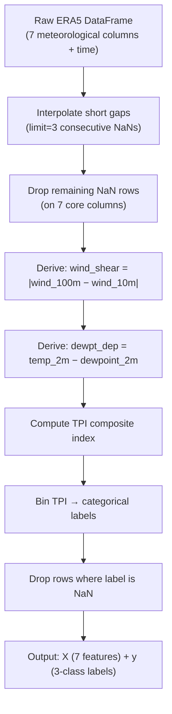
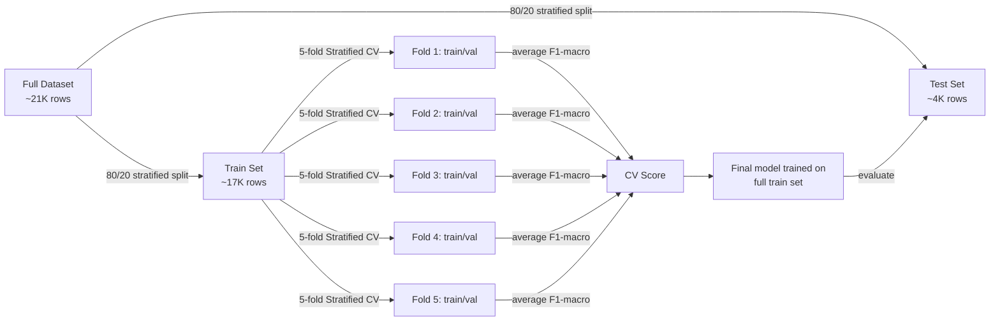
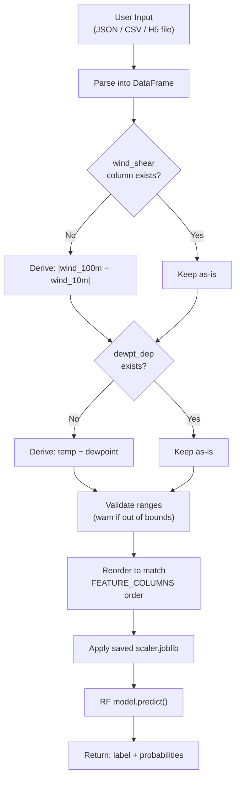

# Deep Analysis: Data Processing, Statistics & Model Choice

A complete breakdown of how data flows through your turbulence prediction system — from raw meteorological observations to final predictions.

---

## 1. Data Acquisition

Your project has **two data sources**, both feeding the same ML pipeline:

### Source A — ERA5 Reanalysis (Primary, for training)

| Aspect | Detail |
|---|---|
| **API** | [Open-Meteo ERA5 Archive](https://archive-api.open-meteo.com/v1/era5) (free, no key) |
| **Resolution** | Hourly, ~31 km grid |
| **Coverage** | Global, 1940–present |
| **Raw variables** | `temperature_2m`, `dewpoint_2m`, `surface_pressure`, `wind_speed_10m`, `wind_speed_100m`, `relative_humidity_2m`, `cloud_cover` |

> [!NOTE]
> ERA5 is ECMWF's 5th-generation global reanalysis — it assimilates billions of real observations (radiosondes, aircraft, satellite) into a physics-based atmospheric model. This is **not raw observations** but a physically consistent reconstruction, which is why it has no gaps.

**Code path:** [utils.py:fetch_era5_hourly()](file:///Users/ananyakarn/Desktop/dev_ananya/DeepLearningTurbulencePredictionModel/training/utils.py#L21-L73)

### Source B — MOSDAC Satellite (Secondary, for inference/streaming)

| Aspect | Detail |
|---|---|
| **Source** | ISRO's INSAT-3D/3DR satellite products |
| **Format** | HDF5 (`.h5`) files with 2D geospatial grids |
| **Variables** | `CTP` (Cloud Top Pressure), `CTT` (Cloud Top Temperature), `Latitude`, `Longitude` |
| **Pipeline** | `data_pipeline/read_mosdac.py` → flattens `.h5` grids → `mosdac_flat.csv.gz` |

**Code path:** [read_mosdac.py](file:///Users/ananyakarn/Desktop/dev_ananya/DeepLearningTurbulencePredictionModel/data_pipeline/read_mosdac.py) and [process_mosdac_perfile.py](file:///Users/ananyakarn/Desktop/dev_ananya/DeepLearningTurbulencePredictionModel/data_pipeline/process_mosdac_perfile.py)

---

## 2. Data Cleaning & Reduction

### Step-by-step in [make_features_and_labels()](file:///Users/ananyakarn/Desktop/dev_ananya/DeepLearningTurbulencePredictionModel/training/utils.py#L123-L181):



### What each step does and why:

| Step | Code | Rationale |
|---|---|---|
| **Interpolation** | `df.interpolate(limit=3)` | Fills small temporal gaps (≤3 hours) using linear interpolation. ERA5 rarely has gaps, but API responses occasionally drop rows. Limit=3 prevents fabricating data over long periods. |
| **NaN dropping** | `.dropna(subset=[7 cols])` | After interpolation, any row still missing a core variable is removed. This is a **listwise deletion** strategy — safe here because ERA5 data is >99.9% complete. |
| **Fill-value filtering** (MOSDAC) | `lat_flat != 32767` | MOSDAC `.h5` files use 32767 as a sentinel/fill value for invalid pixels. These are masked out before any processing. |
| **Geospatial bbox** (MOSDAC) | Optional lon/lat bounding box | Reduces satellite data to a region of interest (e.g., India: 68°–98°E, 6°–37°N). |

> [!IMPORTANT]
> **Data reduction summary**: The pipeline takes ~180 days × 24 hours × 5 locations = **~21,600 raw records** per training run. After NaN cleanup, typically <1% of rows are dropped, leaving ~21,000+ usable samples.

---

## 3. Feature Engineering

The system extracts **7 features** from the raw data:

| # | Feature | Source | How derived | Physical meaning |
|---|---|---|---|---|
| 1 | `wind_speed_10m` | ERA5 direct | Raw | Surface wind speed (m/s) |
| 2 | `wind_speed_100m` | ERA5 direct | Raw | Upper-level wind speed (m/s) |
| 3 | `wind_shear` | **Derived** | `|wind_100m − wind_10m|` | Vertical wind speed difference — primary turbulence driver |
| 4 | `relative_humidity_2m` | ERA5 direct | Raw | Atmospheric moisture (%) |
| 5 | `cloud_cover` | ERA5 direct | Raw | Total cloud coverage (%) |
| 6 | `surface_pressure` | ERA5 direct | Raw | Barometric pressure (hPa) |
| 7 | `dewpt_dep` | **Derived** | `temp_2m − dewpoint_2m` | Dew-point depression — indicates atmospheric instability |

> [!TIP]
> **Why these features matter for turbulence:**
> - **Wind shear** is the #1 cause of Clear Air Turbulence (CAT) — differences in wind speed/direction at different altitudes tear air masses apart
> - **Dew-point depression** measures how far the air is from saturation — low values mean convective instability (thunderstorm/turbulence risk)
> - **Cloud cover** correlates with convective activity
> - **Surface pressure** gradients indicate frontal systems

---

## 4. Data Scaling & Normalization

### Method: `StandardScaler` (Z-score normalization)

```python
scaler = StandardScaler()
X_train_s = scaler.fit_transform(X_train)  # fit on training set only
X_test_s = scaler.transform(X_test)        # apply same transform to test
```

**Code location:** [train_model.py:L112-L114](file:///Users/ananyakarn/Desktop/dev_ananya/DeepLearningTurbulencePredictionModel/training/train_model.py#L112-L114)

### What it does:

For each feature column:

$$X_{scaled} = \frac{X - \mu}{\sigma}$$

| Aspect | Detail |
|---|---|
| **Transform** | Centers each feature at mean=0, scales to std=1 |
| **Fit on** | Training set only (prevents data leakage) |
| **Applied at inference** | Same scaler loaded and applied to new data |
| **Saved as** | `model_artifacts/scaler.joblib` |

### Why StandardScaler and not other options?

| Method | When to use | Used here? |
|---|---|---|
| **StandardScaler** ✅ | Features with roughly Gaussian distributions, different scales | Yes — wind speeds (0–120 m/s) vs humidity (0–100%) vs pressure (800–1100 hPa) are on vastly different scales |
| MinMaxScaler | When you need bounded [0,1] output | No — sensitive to outliers, which weather data can have |
| RobustScaler | Heavily skewed data with outliers | Could work, but ERA5 reanalysis is already quality-controlled |
| None | Decision trees don't technically need scaling | RF is scale-invariant, but the scaler is used for **consistency at inference** — ensuring the same transform is applied |

> [!WARNING]
> **Important nuance**: Random Forest is actually **invariant to monotonic feature scaling** — it splits on thresholds, not distances. The `StandardScaler` here is somewhat redundant for RF itself, but serves as good practice for:
> 1. Consistent preprocessing at inference time
> 2. Future-proofing if you swap to a gradient-based model (neural nets, SVMs)
> 3. Making feature importance magnitudes more interpretable

---

## 5. Labeling Strategy — Turbulence Potential Index (TPI)

Since there's no ground-truth turbulence label in the data, labels are **synthetically generated** using a physics-based composite:

### TPI Formula:

```
TPI = 0.40 × wind_shear
    + 0.25 × (100 − relative_humidity)
    + 0.20 × cloud_cover
    + 0.15 × dewpt_dep
```

### Label Binning:

| Class | TPI Range | ICAO Category |
|---|---|---|
| **Low** | TPI < 12 | Light or nil turbulence |
| **Moderate** | 12 ≤ TPI < 28 | Moderate — passengers feel strain against belts |
| **Severe** | TPI ≥ 28 | Severe — structural damage risk, injuries likely |

**Code:** [utils.py:L166-L178](file:///Users/ananyakarn/Desktop/dev_ananya/DeepLearningTurbulencePredictionModel/training/utils.py#L166-L178)

> [!CAUTION]
> **This is a self-supervised/heuristic labeling scheme, not ground truth.** The model is learning to reproduce these physics-based rules. This means:
> - The model can **generalize** the rules to new combinations of features (non-linear interactions)
> - But it can never be **more accurate** than the TPI formula itself
> - For real-world deployment, you'd want PIREP (Pilot Report) data or ICAO turbulence observations as ground truth

---

## 6. Model Choice — Random Forest

### What's used:

```python
RandomForestClassifier(
    n_estimators=300,        # 300 decision trees
    class_weight="balanced", # upweights minority classes
    random_state=42,
    n_jobs=-1,               # use all CPU cores
)
```

### Why Random Forest?

| Criterion | Random Forest | Deep Learning (LSTM/CNN) | XGBoost / LightGBM | SVM |
|---|---|---|---|---|
| **Data size needed** | ✅ Works well with ~20K samples | ❌ Needs 100K+ to shine | ✅ Good with 20K | ⚠️ OK but slow with >10K |
| **Feature interactions** | ✅ Captures non-linear interactions via tree splits | ✅ Excellent at temporal patterns | ✅ Better boosted interactions | ⚠️ Needs kernel engineering |
| **Interpretability** | ✅ Feature importances, tree visualization | ❌ Black box | ⚠️ Moderate (SHAP needed) | ❌ Black box |
| **Overfitting risk** | ✅ Low (bagging + random feature selection) | ❌ High with small data | ⚠️ Moderate (needs tuning) | ⚠️ Moderate |
| **Training speed** | ✅ ~seconds for 20K rows | ❌ Minutes to hours | ✅ Fast | ⚠️ Slower |
| **Handles imbalanced classes** | ✅ `class_weight="balanced"` built-in | ❌ Needs custom loss functions | ⚠️ Needs `scale_pos_weight` | ⚠️ Needs weighting |
| **No scaling required** | ✅ Scale-invariant | ❌ Must normalize | ✅ Scale-invariant | ❌ Must normalize |

### Better alternatives to consider:

| Model | When it's better | Effort to switch |
|---|---|---|
| **XGBoost/LightGBM** | If you want ~2-5% accuracy boost with hyperparameter tuning. Gradient boosting typically outperforms RF on structured/tabular data. | Low — drop-in replacement |
| **LSTM / Temporal CNN** | If you reshape data as **time series** (sequence of hourly readings → predict next hour's turbulence). Currently unused — each row is treated independently. | High — needs sequence windowing, GPU |
| **Stacked Ensemble** | Combine RF + XGBoost + a linear model via meta-learner | Medium |
| **CatBoost** | If you add categorical features (airport code, season) | Low |

> [!TIP]
> **The most impactful upgrade isn't the model — it's the labels.** Replacing the synthetic TPI with real pilot reports (PIREPs) or aircraft EDR (Eddy Dissipation Rate) data would improve real-world accuracy far more than switching from RF to XGBoost.

---

## 7. Validation & Cross-Validation

### Strategy:



| Aspect | Implementation |
|---|---|
| **Train/test split** | 80/20, stratified by class label |
| **Cross-validation** | 5-fold Stratified K-Fold on training set |
| **Metric** | F1-macro (averages F1 across all 3 classes equally, handles imbalance) |
| **Final evaluation** | Classification report + confusion matrix on held-out test set |
| **Class balancing** | `class_weight="balanced"` — inversely weights classes by frequency |

**Code:** [train_model.py:L106-L143](file:///Users/ananyakarn/Desktop/dev_ananya/DeepLearningTurbulencePredictionModel/training/train_model.py#L106-L143)

---

## 8. Inference-Time Data Flow

At prediction time, the API applies the **same feature engineering** to new data:



**Code:** [app.py:predict()](file:///Users/ananyakarn/Desktop/dev_ananya/DeepLearningTurbulencePredictionModel/api/app.py#L347-L458) and [app.py:validate_dataframe()](file:///Users/ananyakarn/Desktop/dev_ananya/DeepLearningTurbulencePredictionModel/api/app.py#L91-L109)

---

## Summary Table

| Aspect | What's Done | Where |
|---|---|---|
| **Data source** | ERA5 reanalysis via Open-Meteo API | `training/utils.py` |
| **Cleaning** | Interpolate (limit=3) → drop NaN | `utils.py:L156-159` |
| **Feature engineering** | 5 raw + 2 derived = 7 features | `utils.py:L162-163` |
| **Labeling** | Physics-based TPI → 3-class bins | `utils.py:L166-178` |
| **Scaling** | StandardScaler (z-score) on train set | `train_model.py:L112-114` |
| **Model** | RandomForest (300 trees, balanced weights) | `train_model.py:L117-122` |
| **Validation** | 5-fold stratified CV + held-out test | `train_model.py:L124-143` |
| **Metric** | F1-macro (handles class imbalance) | `train_model.py:L126` |
