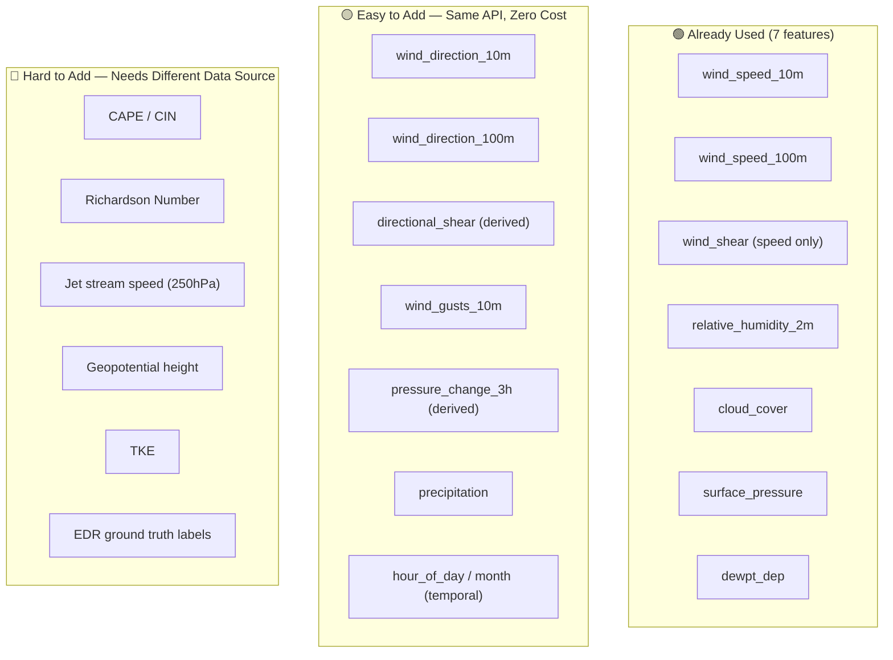

# Research: Variables Required for Turbulence Detection & Prediction

A comprehensive survey of the meteorological variables used across academic literature, operational forecasting (ICAO/FAA/ECMWF), and ML-based turbulence prediction systems — mapped against what your project currently uses.

---

## 1. The Three Types of Aviation Turbulence

Different turbulence types are driven by **different physical mechanisms**, each requiring different input variables:

| Type | Cause | Where | Key Variables |
|---|---|---|---|
| **Clear Air Turbulence (CAT)** | Wind shear near jet streams, Kelvin-Helmholtz instability | Upper troposphere (FL200–FL450) | Wind shear, Richardson number, jet stream position, deformation |
| **Convective Turbulence (CIT)** | Thunderstorms, deep convection | All altitudes near convection | CAPE, vertical velocity, cloud top temperature, precipitation |
| **Mountain Wave Turbulence (MWT)** | Airflow over terrain | Downwind of mountains | Terrain height, cross-mountain wind, Froude number, stability |

---

## 2. Complete Variable Taxonomy

### Category A — Wind & Shear Variables (CRITICAL)

These are the **#1 predictors** of turbulence across all literature.

| Variable | Symbol | Unit | Why it matters | Used in your project? |
|---|---|---|---|---|
| **Wind speed at surface (10m)** | V₁₀ | m/s | Surface wind baseline | ✅ `wind_speed_10m` |
| **Wind speed at altitude (100m)** | V₁₀₀ | m/s | Upper-level wind for shear calculation | ✅ `wind_speed_100m` |
| **Vertical Wind Shear** | VWS | m/s per km | Primary CAT driver — difference in wind speed between layers | ✅ `wind_shear` (derived) |
| **Wind direction at surface** | θ₁₀ | degrees | Direction changes indicate frontal zones | ❌ Available in ERA5 |
| **Wind direction at altitude** | θ₁₀₀ | degrees | Directional shear (wind backing/veering) is a strong CAT signal | ❌ Available in ERA5 |
| **Directional wind shear** | Δθ | degrees | Difference in wind direction between layers — causes turbulent mixing | ❌ **Can derive from above** |
| **Wind gusts (10m)** | Gust | m/s | Sudden speed variations indicate existing turbulence | ❌ Available in ERA5 |
| **Jet stream wind speed (250 hPa)** | V₂₅₀ | m/s | Turbulence concentrates at jet stream edges | ❌ Not in ERA5 surface API |
| **U-component of wind** | u | m/s | Zonal wind for deformation/divergence calculations | ❌ Not in ERA5 surface API |
| **V-component of wind** | v | m/s | Meridional wind for vorticity calculations | ❌ Not in ERA5 surface API |

> [!IMPORTANT]
> **Directional wind shear is the biggest gap in your current feature set.** A wind backing from 180° to 270° between 10m and 100m creates severe turbulence even if the *speed* difference is small. Your current `wind_shear` only captures speed difference, not directional change. Both `wind_direction_10m` and `wind_direction_100m` are **freely available** from the same ERA5 API you already use.

---

### Category B — Thermodynamic & Stability Variables (HIGH IMPORTANCE)

| Variable | Symbol | Unit | Why it matters | Used in your project? |
|---|---|---|---|---|
| **Temperature (2m)** | T₂ₘ | °C | Used to derive dewpoint depression and stability | ✅ (indirectly, for `dewpt_dep`) |
| **Dewpoint temperature** | T_d | °C | Moisture content indicator | ✅ (indirectly, for `dewpt_dep`) |
| **Dewpoint depression** | T−T_d | °C | Low values → convective instability, potential thunderstorms | ✅ `dewpt_dep` |
| **Surface pressure** | P_sfc | hPa | Pressure gradients indicate frontal systems | ✅ `surface_pressure` |
| **CAPE** | CAPE | J/kg | Convective Available Potential Energy — **the** thunderstorm/convective turbulence indicator | ❌ Not available via ERA5 API* |
| **CIN** | CIN | J/kg | Convective Inhibition — suppresses convection; if CAPE is high but CIN drops, expect explosive convection | ❌ Not available via ERA5 API |
| **Lapse rate** | Γ | °C/km | Rate of temp decrease with altitude — steep lapse rates → instability | ❌ Needs multi-level temp data |
| **Potential temperature** | θ | K | Conservative quantity; gradients indicate stability layers | ❌ Needs pressure-level data |
| **Brunt-Väisälä frequency** | N² | s⁻² | Static stability measure — low N² means weakly stable = turbulence prone | ❌ Needs vertical temperature profile |
| **Richardson Number** | Ri | dimensionless | **Gold standard stability indicator**: Ri = N²/VWS². Turbulence when Ri < 0.25 | ❌ Needs N² and VWS at altitude |
| **Geopotential height (500 hPa)** | Z₅₀₀ | m | Identifies troughs, ridges, and jet stream location — synoptic-scale CAT trigger | ❌ Not in ERA5 surface API |

> [!NOTE]
> **Richardson Number (Ri)** is the single most established turbulence diagnostic in atmospheric science. It requires vertical profiles of temperature and wind — data available from full ERA5 pressure-level datasets on Copernicus CDS, but **not** via the simplified Open-Meteo surface API your project uses.

*\*CAPE returns `null` from the ERA5 Archive API on Open-Meteo. It IS available from Copernicus CDS directly.*

---

### Category C — Cloud & Moisture Variables (MODERATE IMPORTANCE)

| Variable | Symbol | Unit | Why it matters | Used in your project? |
|---|---|---|---|---|
| **Cloud cover (total)** | CC | % | High cloud cover correlates with convective activity | ✅ `cloud_cover` |
| **Relative humidity (2m)** | RH₂ₘ | % | Atmospheric moisture saturation | ✅ `relative_humidity_2m` |
| **Cloud Top Pressure** | CTP | hPa | Lower CTP → taller storms → more turbulence | ✅ (MOSDAC path only) |
| **Cloud Top Temperature** | CTT | °C | Very low CTT indicates deep convection reaching tropopause | ✅ (MOSDAC path only) |
| **Precipitation rate** | P_rate | mm/h | Active precipitation often co-located with turbulence | ❌ Available in ERA5 |
| **Specific humidity** | q | g/kg | More precise moisture measure than RH | ❌ Not in surface API |
| **Cloud base height** | CBH | m | Low cloud bases in unstable air → turbulence risk on approach | ❌ Not in ERA5 |

---

### Category D — Derived Turbulence Diagnostics (USED IN RESEARCH)

These are **composite indices** computed from the raw variables above. They represent the established physics of turbulence prediction.

| Diagnostic | Formula | What it detects | Your project equivalent |
|---|---|---|---|
| **TI1 (Ellrod Index)** | VWS × DEF (deformation) | CAT near jet streams — the most widely used operational CAT index | ❌ Not computed |
| **TI2 (Ellrod Index 2)** | VWS × (DEF + CVG) | CAT with convergence component | ❌ Not computed |
| **Richardson Number** | Ri = N² / (∂V/∂z)² | KH instability — turbulence when Ri < 0.25 | ❌ Not computed |
| **Turbulence Kinetic Energy** | TKE = ½(u'² + v'² + w'²) | Direct turbulence energy measure | ❌ Needs high-res model output |
| **Colson-Panofsky Index** | Based on wind shear and stability | Low-level turbulence | ❌ Not computed |
| **Dutton Index** | VWS + f(Ri) | Combined shear-stability diagnostic | ❌ Not computed |
| **Brown Index** | Based on deformation and thermal advection | Frontogenetic turbulence | ❌ Not computed |
| **Turbulence Potential Index** | Weighted composite of shear, humidity, cloud, dewpoint | Custom composite turbulence proxy | ✅ **Your TPI** (custom version) |

> [!TIP]
> Your custom TPI is a **reasonable approximation** given the limited variables from the Open-Meteo surface API. However, it differs fundamentally from established indices (Ellrod TI1/TI2, Richardson) because it uses surface-level data rather than upper-atmosphere data where most aviation turbulence occurs.

---

### Category E — Ground Truth / Target Labels (FOR SUPERVISED LEARNING)

| Data source | What it is | How it's used | Available? |
|---|---|---|---|
| **EDR (Eddy Dissipation Rate)** | Aircraft-measured turbulence intensity (m²/³ s⁻¹) — **ICAO standard** | Gold-standard target label for ML models | ❌ Requires airline data partnerships (Delta, United share with NOAA) |
| **PIREPs** | Pilot Reports — subjective turbulence reports (Nil/Light/Moderate/Severe) | Ground-truth labels for training | ❌ Available from [aviationweather.gov](https://aviationweather.gov) |
| **SIGMET/AIRMET** | Official turbulence warnings issued by meteorological authorities | Validation data | ❌ Publicly available from aviation weather services |
| **Synthetic TPI labels** | Physics-based composite index thresholded into categories | Training labels when no ground truth exists | ✅ **Your current approach** |

---

## 3. Gap Analysis: Your Project vs. Best Practice

### What you currently have (7 features):

```
wind_speed_10m, wind_speed_100m, wind_shear, 
relative_humidity_2m, cloud_cover, surface_pressure, dewpt_dep
```

### What the literature recommends — prioritized by impact:



---

## 4. Recommended Additional Variables (Available FREE from Same API)

These can be added to your `fetch_era5_hourly()` function **right now** with minimal code changes:

| Variable | Open-Meteo parameter name | Derived feature | Impact on turbulence prediction |
|---|---|---|---|
| **Wind direction 10m** | `wind_direction_10m` | → `directional_shear` = angular diff between 10m and 100m directions | **HIGH** — captures rotational shear the current model completely misses |
| **Wind direction 100m** | `wind_direction_100m` | (used with above) | **HIGH** |
| **Wind gusts 10m** | `wind_gusts_10m` | → `gust_factor` = gusts / mean wind speed | **MEDIUM** — high gust factor indicates existing turbulent eddies |
| **Precipitation** | `precipitation` | Raw or binary (is it raining?) | **MEDIUM** — convective precip correlates with turbulence |
| **Snowfall** | `snowfall` | Binary flag | **LOW** — winter turbulence indicator |
| **Pressure tendency** | Derived from `surface_pressure` | → `pressure_change_3h` = P(t) − P(t−3) | **MEDIUM** — rapid pressure drops indicate approaching fronts |
| **Hour of day** | Derived from `time` | → `sin(2π·hour/24)`, `cos(2π·hour/24)` | **MEDIUM** — convective turbulence peaks in afternoon |
| **Month / season** | Derived from `time` | → `sin(2π·month/12)`, `cos(2π·month/12)` | **LOW-MEDIUM** — CAT is more common in winter |

### Proposed upgraded feature set (7 → 14 features):

| # | Feature | Source |
|---|---|---|
| 1 | `wind_speed_10m` | ERA5 (existing) |
| 2 | `wind_speed_100m` | ERA5 (existing) |
| 3 | `wind_shear` | Derived (existing) |
| 4 | `relative_humidity_2m` | ERA5 (existing) |
| 5 | `cloud_cover` | ERA5 (existing) |
| 6 | `surface_pressure` | ERA5 (existing) |
| 7 | `dewpt_dep` | Derived (existing) |
| 8 | **`directional_shear`** | **NEW** — angular difference between wind_direction_100m and wind_direction_10m |
| 9 | **`gust_factor`** | **NEW** — wind_gusts_10m / wind_speed_10m |
| 10 | **`precipitation`** | **NEW** — direct from ERA5 |
| 11 | **`pressure_change_3h`** | **NEW** — derived from surface_pressure time series |
| 12 | **`hour_sin`** | **NEW** — sin(2π·hour/24) for cyclical encoding |
| 13 | **`hour_cos`** | **NEW** — cos(2π·hour/24) for cyclical encoding |
| 14 | **`wind_gusts_10m`** | **NEW** — direct from ERA5 |

---

## 5. Variables That Would Require a Different Data Source

If you want to go beyond what Open-Meteo's surface ERA5 API provides:

| Variable | Where to get it | Difficulty | Impact |
|---|---|---|---|
| **CAPE** | Copernicus CDS ERA5 pressure-level dataset | Medium (free, needs registration + netCDF processing) | High for convective turbulence |
| **Upper-level winds (250/300 hPa)** | Copernicus CDS | Medium | Very high for CAT |
| **Geopotential height** | Copernicus CDS | Medium | High for jet stream diagnostics |
| **Richardson Number** | Compute from CDS pressure-level temp + wind | High (multi-level calculation) | Very high — gold standard |
| **EDR observations** | NOAA AMDAR / airline partnerships | Very high (restricted access) | Transformational — real ground truth |
| **PIREPs** | [aviationweather.gov](https://aviationweather.gov) | Medium (web scraping + parsing) | High — real pilot-reported turbulence |
| **Satellite water vapor bands** | MOSDAC / EUMETSAT | Medium | High for detecting CAT-producing gravity waves |

---

## 6. Summary: Priority Action Items

| Priority | Action | Effort | Expected Improvement |
|---|---|---|---|
| 🔴 **P0** | Add `wind_direction_10m`, `wind_direction_100m` → derive `directional_shear` | ~20 lines of code | Captures rotational shear — **largest single feature gap** |
| 🟠 **P1** | Add `wind_gusts_10m` → derive `gust_factor` | ~5 lines | Adds real turbulence signal |
| 🟡 **P2** | Add `precipitation` as feature | ~3 lines | Convective turbulence correlation |
| 🟡 **P2** | Derive `pressure_change_3h` from existing pressure data | ~10 lines | Frontal system detection |
| 🟢 **P3** | Add cyclical time features (hour, month) | ~10 lines | Captures diurnal/seasonal patterns |
| 🔵 **P4** | Switch to Copernicus CDS for CAPE + upper-level winds | Major refactor | Enables proper CAT diagnostics |
| 🔵 **P5** | Integrate PIREP data as ground-truth labels | Major data pipeline work | **Biggest possible accuracy improvement** |

---

## References

- Ellrod, G.P. & Knapp, D.I. (1992). *An Objective Clear-Air Turbulence Forecasting Technique.* Weather and Forecasting, 7(1), 150–165.
- Sharman, R. & Lane, T. (2016). *Aviation Turbulence: Processes, Detection, Prediction.* Springer.
- ICAO Doc 9817 (2018). *Manual on Automatic Meteorological Observing Systems at Aerodromes.*
- Kim, J.H. et al. (2022). *Clear-Air Turbulence: Observation, Forecasting, and Climate Change.* Copernicus/WCD.
- ECMWF ERA5 Documentation: [https://doi.org/10.24381/cds.adbb2d47](https://doi.org/10.24381/cds.adbb2d47)
